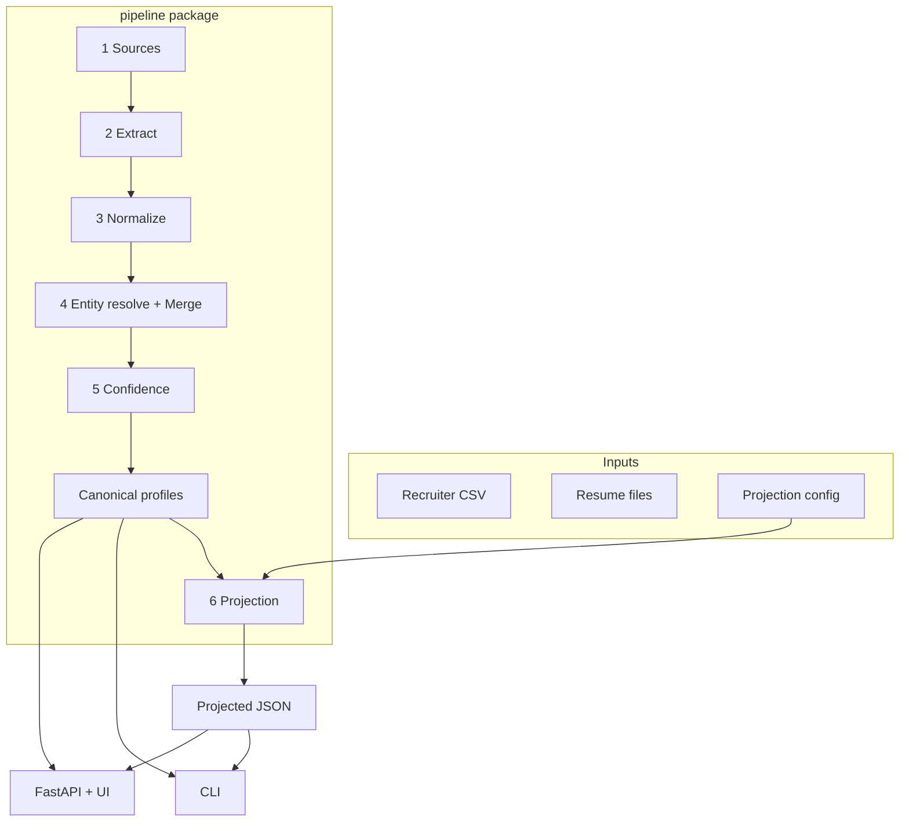
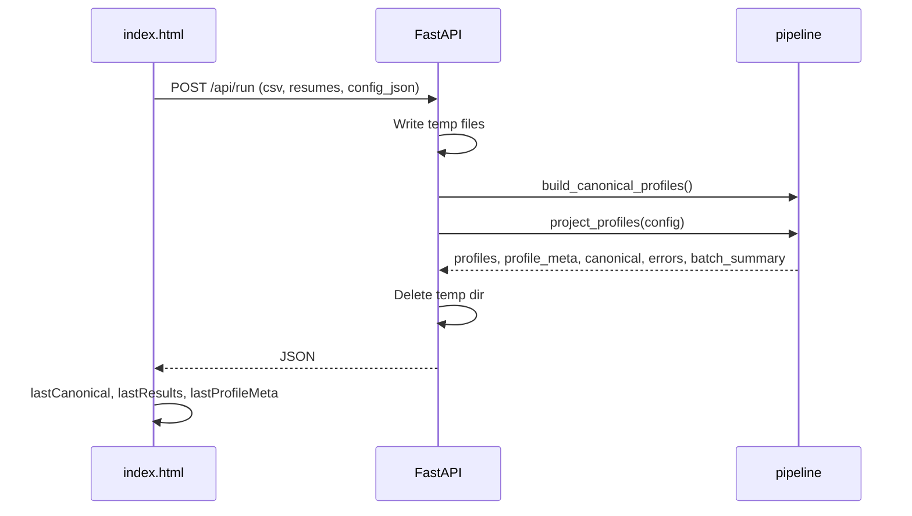

# PROJECT_CONTEXT.md

> Agent onboarding for **candidate-transformer** (*Profile Merge Lab*). Eightfold take-home: recruiter CSV + resumes → merge → score → **runtime JSON projection**.

---

## Project Overview

**Purpose:** Transform messy recruiter data (CSV export + resume files) into structured candidate profiles with confidence, provenance, and configurable output.

**Core twist:** Full **canonical profile** (internal) is separate from **projected JSON** (what callers/UI receive). Config controls field selection, renaming (`from` paths), normalization, confidence/provenance toggles, and `on_missing` behavior.

**Not in scope:** Database, auth, queues, LLM (stubbed/on hold), GitHub source (stub).

### Design Philosophy

1. Deterministic regex/rules first — LLM fallback **on hold**
2. Never crash the batch — log, skip, or degrade
3. Honest uncertainty — raw phones in `phones_raw`; skills below threshold kept as-written
4. CSV wins scalar conflicts (unless years disagreement suppression)
5. Provenance reflects **actual** sources per profile kind

### Tech Stack

Python 3.11+ · `rapidfuzz` · `phonenumbers` · `pdfplumber` · `python-docx` · FastAPI/uvicorn · pytest · single-page HTML/JS UI

---

## Architecture



| Surface | Entry |
|---------|-------|
| **CLI** | `python -m pipeline.cli --csv PATH --resumes DIR [--config JSON -o out.json -v]` |
| **Web** | `uvicorn webapp.server:app --host 0.0.0.0 --port 8001` |

Both call the same `pipeline` package in-process. Web writes uploads to `tempfile.mkdtemp(prefix="eightfold_")`, deletes after response. **No persistence, no auth, CORS open.**

---

## Repository Structure

```
pipeline/          # All business logic (stages 1–6)
  pipeline.py      # build_canonical_profiles, project_profiles, run_pipeline
  sources/         # csv_reader, resume_reader, text_quality
  extract/         # resume_extractor (regex; LLM commented out)
  normalize/       # phones, skills, dates, countries, csv_fields
  merge/           # entity_resolution, merger, source_annotation
  confidence/      # scoring
  project/         # projector, default_config.json
  models/          # raw, canonical, schema
  cli.py, export.py, reasoning.py, logging_config.py
webapp/
  server.py        # FastAPI routes
  static/index.html  # Profile Merge Lab UI
config/            # custom.json + examples/
data/samples/      # Demo CSV + generate_samples.py
test_data*/        # v1, v2 (edge cases), v5 (20 candidates), test_data_config (blind config)
tests/             # ~65 pytest tests
out/               # Generated JSON reports
```

---

## End-to-End Flows

### Web: Run Merge



### Web: Config Change (no re-upload)

User edits config → debounced ~450ms → `POST /api/reproject` with cached `canonical_profiles` + new config → `CanonicalProfile.from_dict` → `project_profiles` only.

### CLI

Same merge + project; writes projected JSON to `-o` or stdout. No `profile_meta` in output.

---

## Pipeline Stages (Detail)

### Stage 1 — Sources

**`csv_reader.py`**
- `DictReader`, UTF-8-BOM, `COLUMN_ALIASES` for header variants
- Output: `RawCsvRecord` with `source_id`, `row_number`, `warnings`
- **Skips** wholly empty rows (no name/email/phone/company/title/resume_path/years/skills/education)

**`resume_reader.py`**
- `.pdf` (pdfplumber), `.docx` (python-docx), `.txt`, limited `.doc`
- Empty → `RawResumeRecord` with warnings
- **`text_quality.is_probably_binary_text`** → treat as corrupted/empty (no garbage names)

### Stage 2 — Extract (`resume_extractor.py`)

Regex-first extraction:
- Name: first line if `looks_like_person_name` (rejects binary garbage)
- Email, phone, LinkedIn/GitHub, URL patterns
- Sections: Experience, Education, Skills (header leak guards)
- Experience blocks + date ranges; education; years from phrases or date math

**LLM fallback: NOT IMPLEMENTED** — `_llm_fallback_extract` stub in file; `.env.example` vars unused.

### Stage 3 — Normalize (`normalize/`)

**Resume:** E.164 via `phonenumbers` when `+` present; else `phones_raw` + method metadata. Skills → `canonicalize_skill`. Country normalization. Date normalization.

**CSV:** Phone same policy. `experience_months` / `years_experience` → float via `resolve_csv_years_experience`. Parse `skills`, `education` strings.

**Phone policy:** No default country region — numbers without `+` stay raw (confidence 0.30).

**Skills:** Alias dict (`SKILL_ALIASES`) then fuzzy match; **≥85%** → canonical, else `kept_original_below_threshold`.

### Stage 4 — Entity Resolution + Merge

**`link_csv_resumes_by_manifest`**
- CSV `resume_path` resolved by **filename only** (flat upload dir)
- Resume linked only if `resume_has_usable_identity` (email, phone, or valid name)
- Unreadable manifest → `manifest_resume_unreadable` on CSV record
- Orphan resumes added once per filename (deduped)
- Resumes without identity skipped (no empty/corrupt ghost profiles)

**`resolve_entities` — match cascade:**
| Pass | Rule | Match confidence |
|------|------|------------------|
| 1 | Exact email | 0.98 |
| 2 | Exact phone (digits only) | 0.92 |
| 3 | Fuzzy name ≥90% **AND** company ≥85% | 0.65 |
| 4 | Singleton | 1.0 |

**NOT used:** name alone, education, `resume_path` alone.

**`merge_group`**
- Priority: `["recruiter_csv", "resume"]` (configurable)
- Scalars: higher priority wins
- Arrays: union + dedup, CSV values first
- `candidate_id`: SHA256(primary email) or `unknown_{source_id}`
- `source_profile_kind`: `merged` | `csv_only` | `resume_only`
- Headline: resume headline, else CSV `title` fallback
- **Years:** if `|csv - resume| / max(csv, resume, 1) > 0.20` → `years_experience = null`, provenance `suppressed_disagreement`, `field_reasoning`

**`apply_source_notices`** — human `source_notice` banners + `data_quality_notice` for sparse/unknown cards.

### Stage 5 — Confidence (`scoring.py`)

- Per-field confidence from `SOURCE_WEIGHTS` + extraction methods
- Skills field score = median tier: alias **0.80**, fuzzy **0.70**, kept-original **0.55**
- Raw phones **0.30**; E.164 **0.95**
- Fuzzy entity match caps **all** field scores at **0.65**
- Overall confidence = weighted mean; `full_name` + `emails` weight **1.5×**
- Provenance: `{field, source, method}` — honest per `csv_only`/`resume_only`/`merged`
- `field_reasoning` for suppressed years, raw phones, below-threshold skills (`reasoning.py` templates)

### Stage 6 — Projection (`projector.py`)

Input: `CanonicalProfile` + config dict.

Per field spec:
- `path` — output key
- `from` — canonical path (`emails[0]`, `phones[0]`, `skills[].name`, `location.country`)
- `type` — `string` | `number` | `string[]` | `object[]` | `object`
- `required`, `normalize` (`E164`/`E.164`, `canonical`)

Globals:
- `include_confidence`, `include_provenance`
- `on_missing`: `null` | `omit` | `error` (raises `ProjectionError`)

Output validated against types. **Source badges NOT in projected JSON** — use `profile_meta` for UI.

**`profile_card_meta`:** `{candidate_id, source_profile_kind, source_notice, data_quality_notice, resume_filename, manifest_resume, csv_row_number}`

---

## Data Layers

| Layer | Type | Notes |
|-------|------|-------|
| Raw | `RawCsvRecord`, `RawResumeRecord` | Stage 1 |
| Extracted | `ExtractedResumeFields` | Stage 2; keyed by path + filename |
| Source | `SourceRecord` | Pre-merge match units |
| Canonical | `CanonicalProfile` | Full fixed schema (`models/schema.py`) |
| Projected | `dict` | Config-shaped API output |

**Browser context:** `canonical_profiles` cached for `/api/reproject`. No cross-request server memory.

---

## Webapp

### API Endpoints

| Method | Path | Purpose |
|--------|------|---------|
| GET | `/` | Serve UI |
| GET | `/api/health` | `{status: ok}` |
| GET | `/api/config/default` | Full projection schema |
| GET | `/api/config/custom` | Assignment-style compact config |
| GET | `/api/samples/csv`, `/list`, `/resume/{name}` | Demo files |
| POST | `/api/run` | Multipart: csv_file, resume_files, config_json? |
| POST | `/api/run/samples` | Built-in samples + config |
| POST | `/api/reproject` | JSON: `{canonical_profiles, config?}` |

### `/api/run` success response

- `profiles` — projected JSON array
- `profile_meta` — parallel UI metadata (badges, notices)
- `canonical_profiles` — full internal records for reproject
- `projection_errors` — `[{candidate_id, full_name, error}]` for `on_missing: error` skips
- `batch_summary` — `{merged, csv_only, resume_only, manifest_mismatches}` from **merge only** (unchanged by config)

### Frontend (`index.html`)

**State:** `csvFile`, `resumeFiles`, `lastCanonical`, `lastResults`, `lastProfileMeta`, `lastBatchSummary`, `currentView` (cards|json)

**Views:** Dossier cards adapt to projected field names (`person_label`, `primary_email`, etc.). Raw JSON copy/download uses `lastResults`.

**Card badges:** CSV + Resume | Not in resume | Not in CSV | CSV ≠ Resume | Unreadable resume

**Banners:** `source_notice` (merge attribution), `data_quality_notice` (red — why Unknown/empty), batch banner (merge counts)

**Auth:** Not implemented.

---

## Business Rules

1. Recruiter CSV authoritative for scalars unless years suppressed
2. Never guess phone country without `+`
3. Never merge on name alone — company must match too
4. `resume_path` links file; identity keys must match to merge
5. Unreadable manifest resume → CSV-only card + notice (not separate garbage profile)
6. Skills unioned from CSV + resume on merge (v5+)
7. Runtime config changes **output shape only**, not canonical merge
8. Batch continues on partial failures
9. Blank CSV rows never become profiles
10. Corrupt/binary resumes never produce named ghost profiles

---

## Thresholds & Constants

| Name | Value | File |
|------|-------|------|
| `NAME_FUZZY_THRESHOLD` | 90 | entity_resolution.py |
| `COMPANY_FUZZY_THRESHOLD` | 85 | entity_resolution.py |
| `YEARS_EXPERIENCE_DISAGREEMENT_THRESHOLD` | 0.20 | entity_resolution.py, merger.py |
| `FUZZY_THRESHOLD` (skills) | 85 | normalize/skills.py |
| Email / phone match confidence | 0.98 / 0.92 | entity_resolution.py |
| Fuzzy entity match cap | 0.65 | entity_resolution.py, scoring.py |
| E.164 / raw phone field confidence | 0.95 / 0.30 | scoring.py |
| Skill tiers | 0.80 / 0.70 / 0.55 | scoring.py |
| `REQUIRED_FIELD_WEIGHT` | 1.5 (full_name, emails) | scoring.py |
| Binary detection | >4% control or >12% non-printable | text_quality.py |
| Name max length | 60 chars | resume_extractor.py |
| UI reproject debounce | ~450ms | index.html |

---

## Configuration

**Files:**
- `pipeline/project/default_config.json` — UI "Default" tab
- `config/custom.json` — UI "Custom" tab
- `config/examples/01–08_*.json` — manual test configs
- `test_data_v2/config_strict_v2.json` — `on_missing: error`
- `test_data_v2/config_lenient_v2.json` — omit, no confidence

**Schema:**
```json
{
  "fields": [
    { "path": "out_key", "from": "canonical.path[0]", "type": "string",
      "required": false, "normalize": "E164" }
  ],
  "include_confidence": true,
  "include_provenance": true,
  "on_missing": "null"
}
```

**Note:** `ISO-3166-alpha2` in strict v2 config is **not implemented** in projector.

**Env (`.env.example`):** `LLM_PROVIDER`, `LLM_MODEL`, `OPENAI_API_KEY` — all unused.

---

## Error Handling

| Failure | Behavior |
|---------|----------|
| Bad/empty CSV row | Warn, skip |
| Corrupt/empty resume | Empty record; CSV may flag unreadable manifest |
| `ProjectionError` | Profile skipped → `projection_errors` |
| Invalid config JSON (web) | HTTP 400 |
| Pipeline exception (web) | HTTP 500 + traceback in `detail` |
| CLI missing paths | Exit 1 |

Logging: pipeline `warn()` to stderr; CLI `-v` for DEBUG; webapp INFO on errors.

---

## Supported vs Unsupported

**Supported:** CSV alias headers; PDF/DOCX/TXT resumes; regex extraction; E.164 phones; skill canonicalization; CSV skills/education/months; entity match cascade; CSV-priority merge; years suppression + reasoning; confidence + provenance; runtime projection (select/rename/normalize/toggles/on_missing); CLI; web UI + reproject; source badges; corrupt file handling; pytest fixtures v1/v2/v5.

**Unsupported:** LLM extraction; GitHub source; database; auth; queues; streaming; country guess for phones; name-only matching; education matching; `ISO-3166-alpha2` projection normalize; i18n resumes; persistent storage; pagination.

---

## Known Limitations

1. Stale CSV — no recency; CSV title may override newer resume by design
2. Overlapping job dates — years calculation may inflate (see test_data_v2 D010)
3. Config `from` typos → silent nulls, not validation errors
4. `batch_summary.manifest_mismatches` counts "do not match" notices only (not unreadable manifest)
5. Flat resume upload — subdirs not preserved
6. `profile_to_card_json` legacy export still used in some test report scripts
7. Root `README.md` empty

---

## Testing

```bash
pytest -v
python -m pipeline.cli --csv test_data_v2/recruiter.csv --resumes test_data_v2/resumes --config config/custom.json -o out.json
python test_data_config/run_blind_config_test.py
```

**Fixtures:** `test_data_v2` = corruption/ambiguity; `test_data_v5` = 20 candidates; `test_data_config` = blind config audit.

**Ground truth:** `pipeline/pipeline.py`, `tests/`, this file.

---

## Glossary

| Term | Meaning |
|------|---------|
| **Canonical profile** | Full internal merged record (fixed schema) |
| **Projected profile** | Config-shaped outward JSON |
| **Source record** | One CSV row or one resume as match unit |
| **Entity group** | Records believed to be same person |
| **Manifest** | CSV `resume_path` column |
| **profile_meta** | UI badges/notices parallel to projection |
| **phones_raw** | Phones that could not become E.164 |
| **suppressed_disagreement** | Years nullified (>20% CSV/resume gap) |
| **on_missing** | `null` \| `omit` \| `error` for projection |

---

## Quick Mental Model

1. Ingest CSV + resumes → normalize everything.
2. Match people: email → phone → fuzzy name+company.
3. Merge to canonical profiles (CSV wins scalars; big years gaps → null + reasoning).
4. Score confidence + provenance per field.
5. Project with JSON config (what the world sees).
6. Web re-projects on config change without re-upload; CLI writes JSON to disk.

**No database. No AI. Deterministic batch ETL + entity resolution + configurable projection.**
